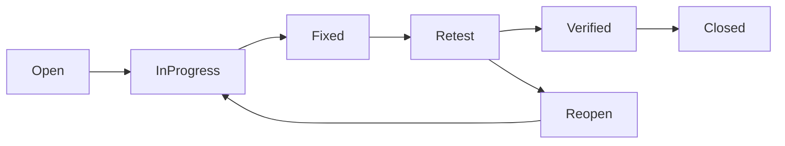

# 🧪 Test Strategy Document for  CleanCity - Waste Pickup Scheduler Web Application

## 1. Introduction

The purpose of this Test Strategy is to outline a structured approach for testing the CleanCity: Waste Pickup Scheduler web application. The application allows users to register, login, schedule waste pickups, provide feedback, and access environmental awareness resources. This document covers the scope, objectives, types of testing, environments, tools, risk mitigation plans, and roles and responsibilities for the QA effort.

---

## 2. Objectives and Tasks

**Objectives:**

- Verify that all functional components of the web app behave as intended.
- Ensure a secure, responsive, and user-friendly experience.
- Identify and fix bugs before deployment to production.
- Provide confidence in the quality and stability of the system across different platforms and user roles.

**Tasks:**

- Requirement analysis.
- Creation and review of test cases for manual and automation testing.
- Execution of test cases and defect reporting.
- Integration and regression testing following new deployments.
- Final QA sign-off before release.

---

## 3. Test Scope

**In-Scope Testing Areas:**

- User registration and login forms
- Pickup request form and scheduling logic
- Feedback form submission
- Dashboard request display and filtering
- Admin panel request management and status updates
- Static pages (Awareness, Home)
- Role-based access control (Admin vs. Regular User vs. Guest)
- Navigation bar behavior based on user state
- Responsive UI testing for all views

**Out-of-Scope Testing:**

- Database performance tuning or schema-level testing
- Backend service testing if mocked or handled by another team
- Third-party email delivery or integrations not present in frontend code

---

## 4. Test Types

**4.1 Functional Testing:**

- Validate form field presence, mandatory checks, and submission behavior.
- Confirm page navigation and session flow (login/logout).

**4.2 UI/UX Testing:**

- Check layout integrity on various devices.
- Ensure consistent styling, fonts, and colors.

**4.3 Regression Testing:**

- After each bug fix or feature update to confirm no side effects.

**4.4 Cross-browser Testing:**

- Browsers: Chrome, Firefox, Edge, Safari
- Devices: Windows, macOS, iOS, Android

**4.5 Accessibility Testing:**

- Keyboard-only navigation
- Color contrast checks
- Screen reader compatibility

**4.6 Security Testing:**

- Ensure sensitive pages are protected behind authentication.
- Attempt unauthorized admin access.
- Validate client-side input sanitization.

**4.7 Performance Testing:**

- Page load speed
- Form responsiveness
- Stress test pickup dashboard with multiple requests

*Metric:*

- load time (<3s)
- Response time under load
- server response time

*Tools:*

- Lighthouse
- WebPageTest
- Chrome DevTools

**4.8 Usability Testing:**

- Evaluate ease of use for feedback and awareness pages.
- First-time user experience for registration and pickup request.

---

## 5. Testing Approach

**Manual Testing:**

- All critical user flows tested manually across multiple browsers.
- Exploratory testing conducted for areas without strict specs (e.g., awareness pages).

**Automation (Optional, Future Scope):**

- Automate login/logout, pickup form, feedback form using pytest /jest.

**Test Design Techniques:**

- Equivalence Partitioning for form inputs
- Boundary Value Analysis for dates and string lengths
- Decision Table for status transitions in admin panel

---

## 6. Test Environment

**Staging URL:** `https://staging.cleancity.gov.ke`

**Browsers:**

- Chrome v114+
- Firefox v115+
- Safari (latest on iOS)
- Microsoft Edge v113+

**Devices:**

- Windows 11 desktop (Chrome, Edge)
- Android 12 smartphone (Chrome)
- iPhone (Safari)

**Data Requirements:**

- Demo accounts (user/admin)
- Sample pickup data (REQ001-REQ005)

---

## 7. Test Deliverables

- Test Plan document
- Manual Test Case Document (JIRA)
- Defect Logs with severity and screenshots
- Daily Test Execution Reports
- Final Test Summary Report
- Automation test scripts (if implemented)

---

## 8. Testing Tools

| Tool            | Purpose                               |
|-----------------|---------------------------------------|
| JIRA            | Test case tracking and defect logging |
| Chrome DevTools | Responsive & performance testing      |
| Jest            | Unit testing for JS components        |
| Postman         | (Optional) API sanity checks          |
| GitHub Issues   | Lightweight bug tracking              |

---

## 9. Roles and Responsibilities

| Role             | Responsibility                                |
|------------------|-----------------------------------------------|
| Ian(Lead)        | Approves strategy, manages test planning      |
| Bednah           | Designs and executes test cases               |
| Ian              | Resolves reported defects                     |
| Wasike           | Validates acceptance and approves features    |

---

## 10. Defect Management

**Tool:** JIRA (or GitHub Issues)

**Severity Levels:**

- Critical: Blocks app functionality or crashes
- High: Major feature broken (e.g., pickup submission fails)
- Medium: Functional but incorrect (e.g., validation missing)
- Low: Visual or minor usability issues

**Status Workflow:** `Open → In Progress → Fixed → Ready for Retest → Verified → Closed`

**Reporting Guidelines:**

- Include environment, browser, steps to reproduce, screenshots, and console logs

**Defect Lifecycle:**

---

## 11. Risk Analysis and Mitigation

| Risk                              | Mitigation Strategy                              |
|-----------------------------------|--------------------------------------------------|
| New features released late        | Plan buffer time for late test execution         |
| Mobile responsiveness issues      | Early mobile testing on physical devices         |
| Admin controls breaking user flows| Write decision table-based test scenarios        |
| Form validations inconsistent     | Test with a matrix of valid/invalid inputs       |
| Incomplete error handling         | Force error states and observe UI responses      |

---

## 12. Entry and Exit Criteria

**Entry Criteria:**

- Functional components are implemented and deployed
- Test environment is accessible and stable
- Required data is available
- Smoke tests passed

**Exit Criteria:**

- 100% test case execution completed
- No open critical/high severity bugs
- All medium/low bugs reviewed or accepted
- Test Summary Report signed off by QA's and module lead

---

## 13. Test Schedule

| Phase                  | Timeline (Days) |
|------------------------|-----------------|
| Requirement Review     | 1               |
| Test Case Design       | 2               |
| Test Execution         | 4               |
| Regression Cycle       | 1               |
| Final Sign-Off         | 1               |
| **Total Duration**     | **9 working days** |

---

## 14. Metrics and Reporting

**Test Metrics:**

- Total test cases executed
- Test case pass/fail percentage
- Defect density per module
- Average defect resolution time
- Retest success rate

**Reporting:**

- Daily execution status update (WhatsApp)
- Weekly summary sent to project stakeholders
- Post-release Test Closure Report

---

## 15. Communication Plan

- Daily QA standup with the QA team
- Weekly QA sync with module instructor
- Documentation maintained jira

---

## 16. Approval

This Test Strategy requires formal approval from the following:

- QA Lead
- Module Lead
- QA Team members

Once approved, it becomes the authoritative guide for all QA activities in the CleanCity project.

---

**Document Version:** 1.0  
**Last Updated:** 2025-06-28  
**Prepared By:** Bednag QA, CleanCity
**Reviewed By :** Ian / Wisani
